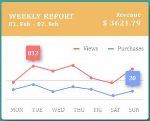

<h1> CSS Nifty Challenges </h1>

Nifty challenges are for practicing and testing CSS learning. It also helps in sharping and adding more values to the frontend styling skillset.

### **Live Demo**: [https://cssnifty.netlify.app](https://cssnifty.netlify.app/)

<h2> Menu Button </h2>

`Description:` Menu Button - almost used on every website by now to view navbar menu on small screen devices. It should be simple yet impressively animated to give great UI/UX.

<table>
  
   <tr align="center">
    <td>
          
    </td>
    <td>
    
    </td>
  </tr>
  <tr align="center">
    <td>
      Inspiration - <a href="https://100dayscss.com/days/4/">https://100dayscss.com/days/4</a>
    </td>
    <td>
       Inspiration - <a href="https://www.youtube.com/watch?v=TD-MFXs2M5E">Online Tutorials</a>
    </td>
  </tr>

</table>

<h2> Loader </h2>

 `Description:` Loader - The best way to engage a user when an application is loading. Nowadays almost every web or mobile application uses different styles of loaders.
<table>
  <tr align="center">
    <td>
         </td>
    <td>
         </td>
  </tr>
  <tr align="center">
    <td>
      Inspiration - <a href="https://100dayscss.com/days/2/">https://100dayscss.com/days/2</a>
    </td>
    <td>
      Inspiration - <a href="https://youtu.be/v3VDVbVdP0w?list=PL5e68lK9hEzeeXtsQCQYd9SAzj6u6wZpi/">Online Tutorials</a>
    </td>
   </tr>
</table>

<h2> Chart </h2>

 `Description:` Chart - Statistics numbers properly crafted in a chart with different colors not only easily comprehended by anyone but also present an aesthetic view to data science. 
<table>
  <tr align="center">
    <td>
         </td>
  </tr>
  <tr align="center">
    <td>
       Inspiration - <a href="https://100dayscss.com/days/5/">https://100dayscss.com/days/5</a>
    </td>
   </tr>
</table>

